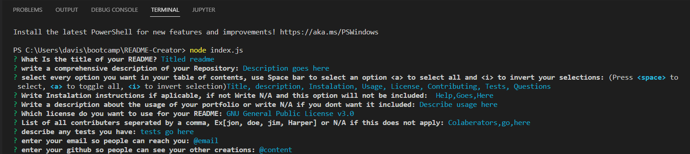

# README-Creator


## Deployed link
None, as this is not a deployed sit, However there is a link to a walktrhgouh video at :

## Interface picture



## Technologies Used
- HTML : Used to format the content of the page
- CSS : Used to style the HTML on the web browser
- JavaScript : Used to give the page logical functions and a dynamic interface
* also include is Node.js and all its functions modules and files
- Git : Used to version control the code during the creation process
- GitHub : hosting the repositroy responsible for the website

## Authors
- writen styled and built by Mason Davis

## summary
This repository contains all the code to generate a unique README.md file on command from the command line prompt. After creation a file will be created and added to the ReadMe-content folder where it can be copied and trnsported to your specified repo.

## Code Snippet
This is a snippet Showing the formula used to generate the markdown file. It takes the file name and path, the data you wish to display, in this case the markdown content and adds an incase of error function. 

```javaScript
 function writeToFile(fileName, data) {
    fs.writeFile(fileName,data ,function(err){
        if(err){
            console.log(err)
        }
    })
}     
```


## Author links
[LinkedIn](https://www.linkedin.com/in/davis-mason-t/)
[GitHub](https://github.com/Md7113)